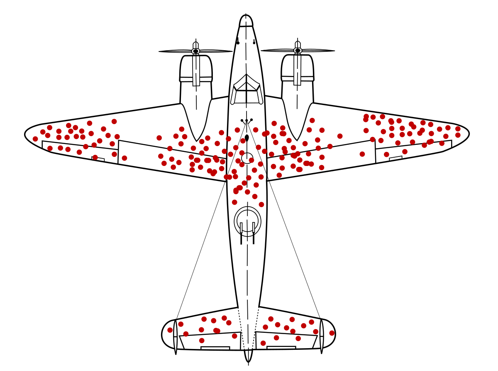

# CSE135 - Online Analytics

> Formerly called "Web Server Technologies"

## Agenda

- Brief Intro
- Class Details
  - history, intentions, etc.
  - Canvas (less use, prof doesn't like it)
  - Slack Overview
- Academic issues, engagement, in-person learning
- Embracing and Studying effects of generative AI
- Introduction Lecture

## Introductions

> Profs ain't just an info bot

Rationale:
- biases
- backgrounds
- practice for user-centered super powers
- soft skills
- get more out of class

## Advice for making the most of the class

- Interact w/ teaching staff, don't be shy
  - prof will hang out after class
  - open slack DMs
  - OH will be posted
  - chat in class

- Use Slack well
  - threads
  - reminders
  - FAQ posts

- Don't be transactional
  - treat TAs with respect
  - Gary's professionalism points lmao

- Attend lectures & engage
- Read -> Think -> Act
- Be ok w/ not knowing --> allow yourself to ask questions

> Discpline beats Ingenuity/"Bozo engineering"

## Course Logistics

- Lecture: In-person for participation EC
- Small group assignments (1-3) students
- Midterm: Week 6
- Assignments use Digital Ocean instance
  - https://education.github.com/pack gets credits for resourcese needed in class

- Final = Projectj + Mini Final Test

## Course Goals

- technical disc of web-based data collection
- understand basic arch of web sites/apps
- familiarity w/ core web tech
  - HTM
  - LCSS
  - JS
  - HTTP
  - Web browswers
  - Web servers
  - server-side programming
    - Nodejs
    - PGP
  - SQL/NoSQL db and related patterns
- understand web data collection 
- lifecycle of data driven decisions oneline
- basics of data visualization/presentation
- awareness of data collection concerns and practices

> Client Web Tech is in 134. Server Web Tech emphasized in 135

## Course Non-Goals

- full stack dev (awareness maybe, but not a one-man band)
- present an in-depth discussion of db tech
- address large scale web data handling
    > hyperfixation on scaling problems is premature optimization. Big assumption of user aceptance first.

- cover any ML aspects other than rough role in th eproess
- cover any Web3 content 
    > snakeoil - like NFTs and other hype cycles

- substitute for 134 (asume 20-25% overlap w/ far less depth)

## FAQ

- Can take w/o 134, but will be harder without. You get more with 134

- Unless ur only doing endpoint stuff, you an't separate backend only stuff from clientside. Analytics req context

- You can ask prof to be pointed towards where new info

> Reliance on data without contextual awareness and careful thinking in my view is more dangerous than it has ever been in m lifetime. Yes this is opinionated but I am not seeing much to shake the option - quite the opposite actually.

-- prof brought up the horseshoe industry arising around the time cars were being introduced to provide some reassurance on the rise of LLM 

# Foundations

- purely technical intro of topics ==> disaster. 
  - inadvertetly trins us to think everything is solved
  - implied certainty/safety stifles discovery and growth

## Online Data Collection

- Internet: can collect LOTS of info from users

### Pros

- improve user satisfaction by monitoring for errors/problems
- provide personalization for indiv dates/preferences
- guide dev practices to better suit users & conditions

### Cons

- gather data w/o consent or awareness
- abuse collected data
- decrease user satisfation by removing control or making choies for them that may benefit you more than them

> Dark patterns: E.g. netflix interface purposefully unoptimized to retain user engagement (despite it wasting users time)

## Rough General Analytics Flow

- form questions
- Collect Data
  - Sanatize and Refine
- Analyse data
  - Raw
  - Visualize
- React
  - Ask more questions
  - Act on analysis

> Sounds like the scientific method. Hypothesize, experiment, repeat

### Yet some think diff

- you collect shit ton of data and figure out question later
- insights arise from data
- belief = exception, not rule
- too much data ==> overconfidense, obfuscation
- messiness ==> deeply wrong ansers
-- Argument of people. Almost seems to be automated nowadays.

> McDonalds: Consistency of mediocrity

> Ex: page view metrics and acceptability story

Big Data != Big Wisom. Rather, == Big Idiocy

## Online DAta Collect Approaches

- Data collected primarily in two ways:
  1. Actively: asking for it
  2. Passively: provided whether you ask for it or not (e.g. logs)

- Alt, Data collection could be:
  1. agent (script)
  2. agent-less (built-in to protocol or delivery env)

### Internet Data Collection Uses

Ranges from innocuous to questionable

- Tracking error rates --> correcting problems as they emerge // collect techno graphics to drive requirements planning

- Measuring ad perf & adjust toimprove click rates

- Build social profile of user based on var signals to feed them content for more engagmenet

- Collect to sell

- `Revisit slides for last bullet point`

### Where and ow

3 major xones for collection:
- Client Side (your device, browser, etc.)
- Network (intercept & service level)
- Server Side (logged by server)

> Webapps are more invasive/monitoring than Native apps? FALSE

> TODO: revisit slides

-- Incognito states not SAVING user info. but there were not claims of not COLLECTING...

## Fingerpreinting Preview

Live Demo: https://fingerprint.com/

Ref material: 
- coveryourtracks.eff.org
- bitstring.com/posts/2023-03-19-web-fingerprinting-is-worse-than-I-thought.html

## Sanity Check: Starbucks

scenario: starbucks employee 
- can identify you based off your appearance
- can remember your previous orders

alt scenario: evilbucks employee
- also sells that info + other data to anyone else that will pay 

> fingerprint itself isn't the problem, it's a Social Contract

## Morale

- Data collection isn't evil per se (nor Fingerprinting)
- Problem: relationship expectations, lack of discloser, and actual abuse (which is far too common)
- tbf, online much of problem stems from lack of admitting "free" isn't really free
  - pay w/ ur privacy and attention
  - pay w/ data collection, selling, advertising (or all of the above)

> thought exercise: what if we paid them $X to NOT track our shit? Well we don't even have that option 

Tim Cook

Challenge of serveillance econ + priv issue: realistic and appropriate reaction to "free" expectations

> Humans: constant
> Technology: variable
>
> prof believes we are reaching a sort of homeostasis in terms of acknowledgement of the costs of internet services (data collections)

Example: prank calls not as common as phones lost novelty. Expecting something similar with 

## Pro Tip: Always check your thinking

Online post w/ a believed quote along the lines of:
> "Intelligent people are not less likely to have illogical beliefs, they're just better at rationalizing their illogical beliefs"

Edit, actual quote:
> "Intelligent people are good at rationalizing their beliefes, including those at which they arrived irrationally"

## Constant Danger - Data isn't truth, it's just data!

-- survivorship bias. "reinforce the places they were shot" doesn't help if those were the planes that made it back, should've focused on the ones that didn't make it back and reinforce the places where THOSE were shot

## Mental Junk Food

2 types of stories that people like
- rags to riches
- people getting what they deserve

Twitter algo publicized

## Toolbox overflows