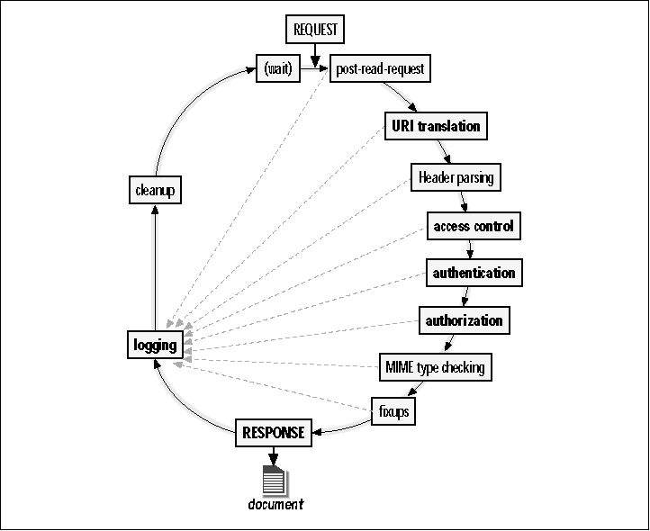

> 10 minutes late, forgot to account for commute time while getting ready. Seems like prof was just doing a live demo of setting up an Apache server

One of the jobs of an HTTP server is: serve files
- permissions
- existence

Apache conf allows setting
- root dir
- log file 
- toggle client scripts

## Analytics 10K

Where we can collect analytical information:

1. Server Side
   - Logfiles
   - Pro: can't be opt-ed out, private on your system
   - Con: limited in what can be recorded, hard to work with
2. Client Side
   - Google Analytics
   - Pro: Lots of tracking possibility (rich data), Easy to use
   - Con: Can be blocked, some data quality problems, abuse
3. Network
   - Network Capture
   - Pro: Can't be opted out of, capture much in one place
   - Con: Like log files limited in what it can see, likely $$$

Three types of web servers/environments
1. Dev
   - local
   - lightweight
   - lack features
2. Stage
   - copy of production
3. Prod/Live
   - remote
   - heavyweight
   - secure/monitored

# Web Server Overview

## The (Programmer | IT) Divide

Obvious why: division of labor
   - IT: Don't touch those knobs! Put them in a sandbox so they dont' hurt things, etc.
   - Dev: I wanna try new framework/software X. I am too busy programming to read logs/install patches

Mind the Gap!
   - Security
   - Performance
   - Huge waste of time/money b/ we don't know enough to meaningfully interact

## Hmm... Something smells fishy

Jobs for WS
1. Serve files
2. Run programs
3. Housekeep / Support
   - logging
   - authentication

> HDD -> SSD -> Cache -> NPU

http://www.channelregister.co.uk/2010/07/29/cray_1_replica/

> An irony is that the resulting scale model Cray-1, ..., is probably more powerful than Cray's original near 40-year-old design

Today, do you need scads of PCs to serve simple Web apps?

- Pickup trucks ain't good
  - state of the industry: low startup cost, high 
- Start low and scale up

## Role of a web Server

- a box and a service
- Web servers serve various *resources*
  - As file (document) servers
  - As application front ends
- Physical server can of course serve any protocols (SMTP, FTP, etc.) or may be protocol specific
  - Web Servers are of course HTTP servers
  - But that's easy, right?

HTTP
  - simple
  - connection-less
  - state-less
    - will have to do it yourself programatically, e.g. w/ cookies 

SuperHTTP
  - blocked by firewall
  - not ubiquitous
  - needs to be backwards compatible

> Hence HTTPS is getting pushed. But Library of Alexandria scenario happening since older sites are getting blackholed. They don't even really need to have a cert, "they're brochures" - not interactions!

## Roughly How Web Servers Work
- Listen for requests
- On request:
  - Decode request
    - what resource? get headers? etc.
  - Is that allowd?
    - No -> Deny (Skip to Log)
    - Maybe -> Authenticate First
  - Continue
    - Get Resource or Run Resource
    - Map MIME
    - Return data
  - Log
- Lather, Rinse, Repeat
  - unless shutdown/crash

## Apache Request/Response Lifecycle

!

Microsoft IIS has a similar lifecycle diagram w/ a few differences

---

Common Log File: IP, Datetime, Request, Success/Error message

Strip disclosing headers

Deciding when to mark cached resources as "stale" is complicated
  - right way: setting headers 
  - cheese: unique appending hash to resource name 
    - state of the industry